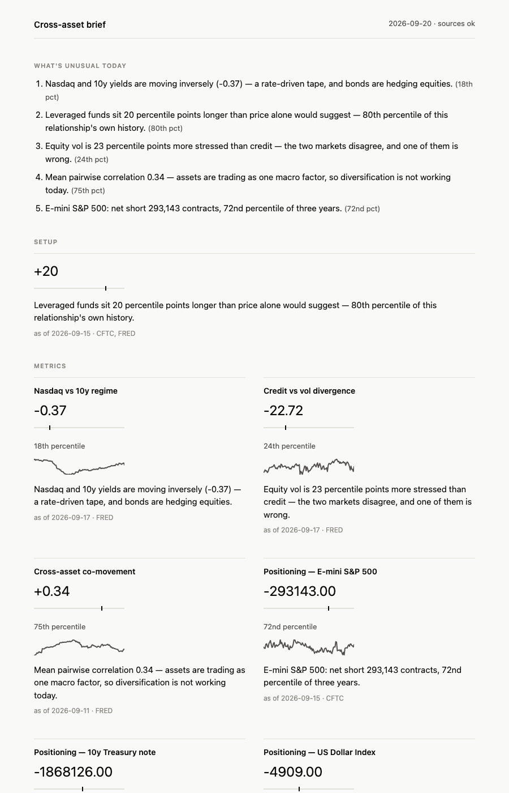

# Cross-asset daily brief

A macro brief, rebuilt hourly through the US session that surfaces what is statistically unusual today
rather than what the levels are. Nine metrics, built from two public
sources — FRED and the CFTC Commitments of Traders — rendered to a single
static HTML page with no backend and no client-side JavaScript.



## Where the numbers come from

Two providers, chosen per series rather than by habit:

- **FRED** for the Treasury curve, real yields, breakevens, funding (SOFR,
  EFFR, IORB) and credit spreads. Official, and far more complete — Yahoo
  carries only three Treasury tenors.
- **Yahoo** for equities, crude, gold and FX. FRED's crude series ran three
  days behind during a week crude fell ten percent, it carries no free daily
  gold at all, and its FX release runs about nine days in arrears. Used
  through plain `requests`; the payload is a timestamp array and a close
  array, so yfinance would add a breakage layer and nothing else.
- **CFTC** for positioning, as before.

Yahoo is unofficial, which is defensible only if it is checked. Every build
reconciles the pairs both providers carry — Nasdaq, S&P 500, the 10y, and
front-month crude against spot Cushing — and the page prints the result.

The comparison is made on the latest date the two sources **share**, never on
each one's own last observation. Publication lag is not disagreement: compared
last-to-last, crude looked 11% apart; compared on the date they share, it is a
1.1% spot-futures basis, which is exactly what it should be.

## The levels board

Above the analysis sits a reference board: equities, the full Treasury curve
(1m through 30y plus 2s10s and 3m10y), the dollar, credit, volatility and
crude. Each carries its level, its 1-day and 1-month move, and its trailing
one-year range.

The range column is the one that earns its place. A level on its own says
nothing about whether it is high or low, and the point of seeing these daily is
to learn their scale rather than to monitor them.

Two display conventions are kept separate on purpose. `kind` decides the
differencing rule used by the metrics — price-like series become log returns,
rate-like series become first differences. `quote` decides only how a number is
written. They are not the same question: VIX is rate-like for the maths but is
quoted in vol points, and the first build of this board rendered a 2.27-point
VIX move as "-227bp". Curve spreads and credit are quoted in basis points, not
as decimals.

## Why these metrics

Every tile has to earn its place by showing something a consumer finance app
cannot. A level or a price fails that test; a percentile, a positioning
extreme, or a cross-asset relationship passes it.

| Metric | Definition |
|---|---|
| Nasdaq vs 10y regime | 60-day rolling correlation of Nasdaq Composite log returns vs 10y Treasury yield changes, percentiled over the full common history |
| Credit vs vol divergence | 5y percentile of the Baa corporate spread minus 5y percentile of the VIX |
| Cross-asset co-movement | Mean pairwise absolute 60d correlation across equity, 10y yield, dollar, credit, crude and VIX |
| Positioning (×5) | Net speculative position per contract, percentiled over 3 years of weekly CoT reports. The category follows the report: **leveraged funds** for E-mini S&P 500, 10y Treasury note and US Dollar Index (Traders in Financial Futures), **managed money** for gold and WTI crude (disaggregated). The two are not interchangeable, and each tile names which one it is showing |
| Positioning-price divergence | 3y leveraged-fund positioning percentile minus 3-month price percentile, for E-mini S&P 500 |
| What's unusual today | The top 5 of all 9 tiles above, ranked by distance from each tile's own 50th percentile |

Two substitutions from the original plan, forced by data availability rather
than choice:

- **Equity is the Nasdaq Composite, not a broader index.** FRED discontinued
  its Wilshire 5000 series entirely, and its replacements — the S&P 500 and
  Dow — are capped to ten years of history by licensing. Ten years would
  have left the regime tile blind to the pre-2020 era it exists to compare
  against, when stocks and bond yields still moved the other way. The S&P
  500 is kept as a second, separate series (`SP500`) purely to pair with the
  E-mini S&P divergence tile, where ten years of daily prices is ample for a
  three-month percentile — a different metric with a different history
  requirement.
- **Credit is the Baa spread (`BAA10Y`), not a high-yield OAS series.** The
  ICE-sourced OAS series FRED carries are now capped to three years of
  history, which cannot support the five-year stress window the divergence
  metric needs. `BAA10Y` runs back to 1986.

Both tiles are named for what they actually measure — "Nasdaq vs 10y regime"
rather than a generic "stock-bond regime" — instead of pretending the
substitution didn't happen.

CFTC also renamed four of the five tracked contracts' `market_and_exchange_names`
on 2022-02-08. Each is spliced across the rename into one continuous series;
gold, never renamed, holds all 1,058 reports back to 2006 and served as the
check that the splice lines up — the pre- and post-rename halves plus gold's
count matched exactly, with no gap and no overlap. The fetch raises if a
splice ever produces an overlapping report date, rather than silently
double-counting a week.

Every tile that claims a reading is notable flags it by **percentile**, not
by a raw threshold, and all of them share one symmetric band
(`NOTABLE_PCTILE = 90`) applied to each metric's *own* percentile history:
divergence, cross-asset co-movement and the five positioning tiles. A
threshold on raw magnitude would compare unlike things, and three different
bands would make "notable" mean three different things on one page. When a
tile sits in the middle of its own history, its sentence still states the
fact — "62nd percentile of its own history" — it never claims the reading is
unremarkable, and equally it never makes a tail-strength claim like
"diversification is not working today" off a 75th-percentile reading. The
percentile carries the judgment; the prose only ever states what happened.

Every tile carries a collapsed "why this is here" disclosure holding two
sentences: what the metric measures, and what a reader should conclude from it.
`why` and `implication` are required fields on `Metric`, alongside `interpret` —
a metric nobody can justify in two sentences cannot be registered.

## Why explainable over sophisticated

No metric in this system has a fitted parameter. Correlations, percentile
ranks and threshold rules only. Every metric's `interpret` function is a
required field of its registry entry, not optional text bolted on later —
a metric that cannot state its meaning in one sentence cannot be registered.

PCA was considered for cross-asset co-movement and rejected: rolling
loadings flip sign, the rotation needs hand-waving, and "percent variance
explained today" is undefined without a window. Mean pairwise absolute
correlation answers the same question in one sentence and is what ships.

Z-scores were rejected everywhere in favor of percentile rank, which
survives fat tails, needs no stationarity assumption the author can verify
at a glance, and explains itself. Percentile is the single vocabulary of
the entire page, which is also what makes it legitimate to rank nine
unrelated metrics against each other in "what's unusual today": distance
from the 50th percentile is comparable across tiles in a way `|z|` would
not be.

## Staleness and failure handling

The board applies the same rule as the tiles, per series. A row whose newest
observation is older than that series' own observed publication lag prints its
date and is marked stale; a row within its lag prints nothing. The broad dollar
index genuinely publishes about nine days in arrears, so a uniform gate would
have marked it stale permanently — and a warning that is always lit is one the
reader stops seeing.


A source that fails degrades the page rather than blanking it: `load_levels`
catches per-series fetch errors and the affected tiles render
`"unavailable — <reason>"` instead of taking the whole build down. A metric
whose series is too short to produce a percentile says so too, rather than
rendering a number with no context. A stale tile still renders — marked
with the word "stale" and a dotted underline — rather than disappearing.

Staleness tolerance is per-series, not a single global cutoff, because
publication lag is a property of each series, not of the metrics that
happen to consume it. Most FRED series get a 5-day gate; the broad dollar
index (`DTWEXBGS`) publishes with an observed ~9-day lag and gets 12 days,
and WTI crude (`DCOILWTICO`) publishes ~5 days late and gets 8. CFTC data is
weekly and already several days old on arrival, so any metric with a CFTC
input gets at least a 12-day gate. A metric's overall gate is the loosest
tolerance among all of its inputs — it is only as fresh as its
slowest-publishing source.

## Running it

```bash
python3.12 -m venv .venv && .venv/bin/pip install -e ".[dev]"
export FRED_API_KEY=<key from fred.stlouisfed.org>
.venv/bin/pytest -W error
.venv/bin/python -m brief.cli build   # writes dist/index.html
```

`scripts/smoke.py` checks every configured series and contract against the
live APIs. It is deliberately excluded from CI — it exists to validate ids,
not to run daily.

## Deployment

The page is meant to run on a schedule via GitHub Actions and deploy to
Cloudflare Pages (`.github/workflows/daily.yml`): tests run before the
build, so a broken metric never reaches the live site. Setting up the
Cloudflare project, GitHub secrets and access gate is a one-time, one-person
task — see [`docs/DEPLOY.md`](docs/DEPLOY.md).
